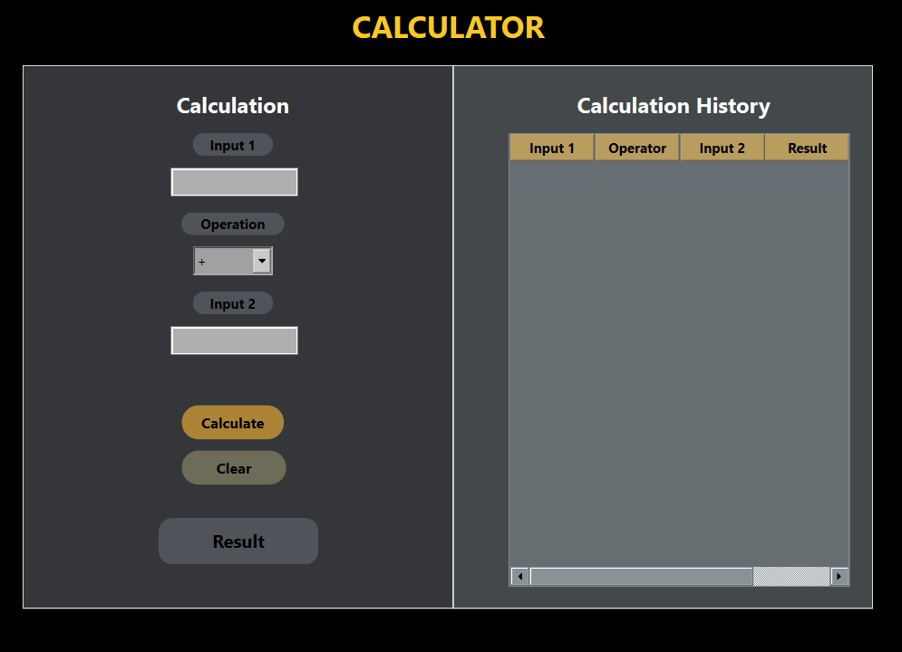

# Qt Calculator 

This Qt C++ application provides a basic calculator capable of basic arithmetic operations (addition, subtraction, multiplication, division). The UI is divided into two main sections: the calculation controls on the left and a history table on the right that logs each calculation.

## Features

- **Arithmetic Operations**: Perform addition, subtraction, multiplication, and division.
- **History Tracking**: Every operation along with its result is logged into a history table for reference.
- **Clear History**: Users can clear the calculation history with a single click.

## Getting Started

These instructions will guide you on how to set up and run the application on your local machine for development and testing purposes.

### Prerequisites

Ensure you have the following installed:
- Qt 5.x SDK
- A C++ compiler compatible with Qt (e.g., GCC, Clang, MSVC)

### Building the Application

1. **Clone the Repository**
   Clone the project to your local machine.

   ```bash
   git clone https://github.com/bugman1215/GUIAppTest.git
   cd GUIAppTest/guiapp
2. **Open the Project**
   Open the project file guiapp.pro with Qt Creator or via the command line.
4. **Configure the Project**
   Configure the project to use the appropriate build settings in Qt Creator or specify the build directory if using the command line.
5. **Build**
   Use the build option in Qt Creator or run the following command in the terminal:
   ```bash
   qmake
   make
### Running the Application
    ```bash
    ./guiapp

### Using the calculator
To perform calculations:
1. Enter values in the number input fields on the left.
2. Choose an operation (addition, subtraction, multiplication, division) from the dropdown menu.
3. Press the "Calculate" button to execute the operation and see the result.The operation and result will automatically be logged in the history table on the right.
4. To clear the history, click the "Clear" button at the bottom of the history table.

  
